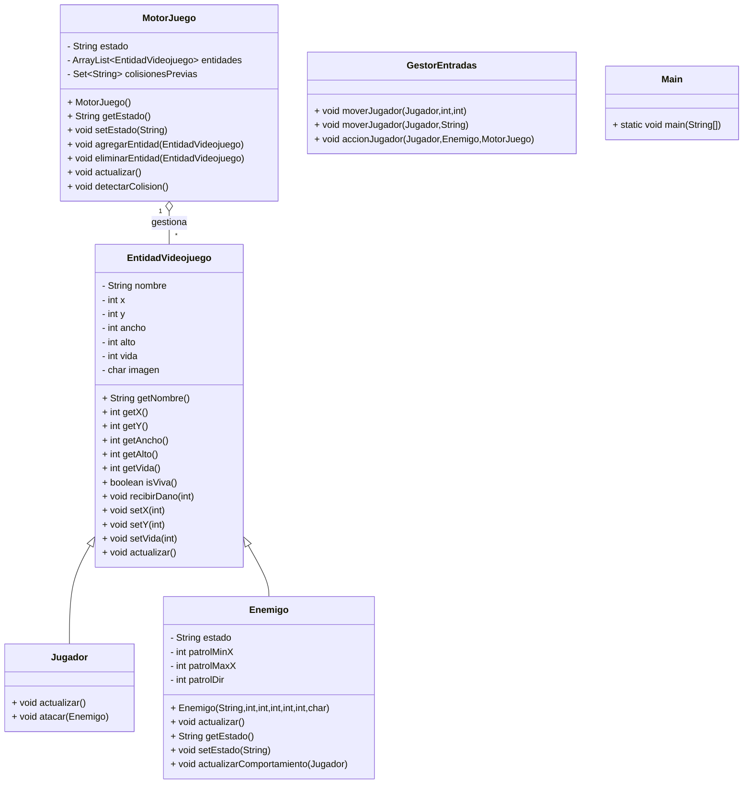
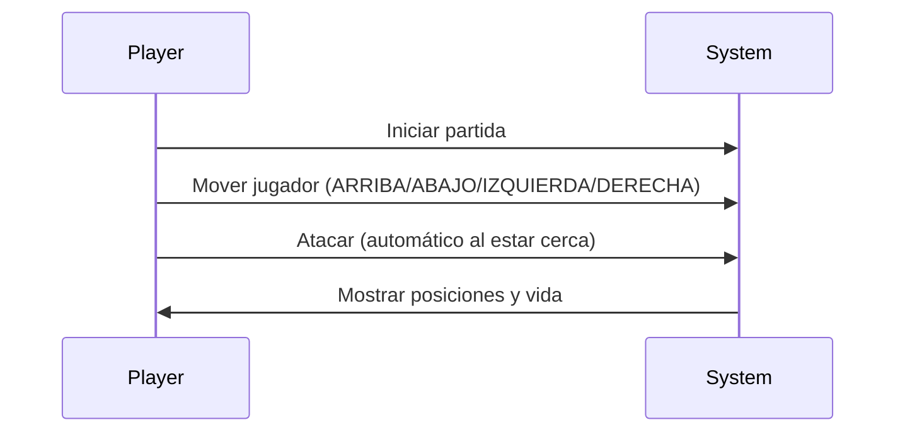

# Space Survival Engine

## 1. Descripción del proyecto

Space Survival Engine es un motor de juego minimalista en Java diseñado como base para prototipos 2D simples. Proporciona una arquitectura orientada a entidades, manejo básico de entradas, un bucle de juego con actualización de entidades, detección de colisiones por cajas (AABB) y comportamientos simples para jugador y enemigo.

Objetivos:
- Ser una base didáctica para aprender patrones de motor de juegos.
- Permitir simulaciones por consola y pruebas rápidas.
- Mantener el código legible y fácil de extender.

## 2. Arquitectura del software

El proyecto sigue una estructura simple centrada en entidades y un motor que coordina actualización y limpieza:

- MotorJuego: bucle principal, gestión de entidades y colisiones.
- EntidadVideojuego (abstracta): representación base de cualquier entidad con posición, tamaño y vida.
- Jugador / Enemigo: implementaciones concretas de entidades.
- GestorEntradas: encapsula la lógica de movimiento y acciones del jugador.
- Main: punto de entrada para ejecutar la simulación por consola.

El flujo típico por turno:
1. `Main` aplica entradas mediante `GestorEntradas`.
2. Se ejecuta la acción del jugador contra enemigos (si procede).
3. `MotorJuego.actualizar()` invoca lógica de cada entidad, gestiona comportamiento de enemigos, detecta colisiones y elimina entidades muertas.

## 3. Explicación de las clases

- `EntidadVideojuego` (abstracta)
  - Atributos privados: `nombre`, `x`, `y`, `ancho`, `alto`, `vida`, `imagen`
  - Métodos públicos: `getNombre()`, `getX()`, `getY()`, `getAncho()`, `getAlto()`, `getVida()`, `isViva()`, `recibirDano(int)`, `setX(int)`, `setY(int)`, `setVida(int)`, `actualizar()` (abstracto)
  - Responsabilidad: proporcionar la interfaz base para posición, tamaño y vida.

- `Jugador` (extiende `EntidadVideojuego`)
  - Métodos públicos: `actualizar()`, `atacar(Enemigo)`
  - Responsabilidad: representar al jugador, mostrar su estado y realizar ataques contra enemigos.

- `Enemigo` (extiende `EntidadVideojuego`)
  - Atributos privados añadidos: `estado`, `patrolMinX`, `patrolMaxX`, `patrolDir`
  - Métodos públicos: `actualizar()`, `getEstado()`, `setEstado(String)`, `actualizarComportamiento(Jugador)`
  - Métodos privados: `patrullar()`, `perseguir(Jugador)`, `atacarJugador(Jugador)`
  - Responsabilidad: comportamiento autónomo con estados `PATRULLAR`, `PERSEGUIR`, `ATACAR`.

- `MotorJuego`
  - Atributos privados: `estado`, `entidades` (ArrayList<EntidadVideojuego>), `colisionesPrevias` (Set<String>)
  - Métodos públicos: `getEstado()`, `setEstado(String)`, `agregarEntidad(EntidadVideojuego)`, `eliminarEntidad(EntidadVideojuego)`, `actualizar()`, `detectarColision()`
  - Responsabilidad: coordinar actualización de entidades, detección de colisiones y limpieza de entidades muertas.

- `GestorEntradas`
  - Métodos públicos: `moverJugador(Jugador,int,int)`, `moverJugador(Jugador,String)`, `accionJugador(Jugador,Enemigo,MotorJuego)`
  - Responsabilidad: encapsular la lógica de entradas y acciones del jugador.

- `Main`
  - Método `main(String[] args)` que prepara entidades, ejecuta una secuencia de comandos de prueba y muestra logs en consola.

## 4. Diagrama UML (Mermaid)



## 5. Diagrama de casos de uso (Mermaid)



Nota: Mermaid tiene soporte limitado para diagramas de casos de uso; arriba se ha usado un diagrama de secuencia simplificado para representar las interacciones principales.

## 6. Especificación de casos de uso

### Caso de Uso: Iniciar partida
- ID: CU-01
- Actor principal: Usuario (Player)
- Propósito: Inicializar el motor, crear entidades y comenzar la simulación por consola.
- Precondiciones: Código fuente compilado; `Main` disponible.
- Flujo principal:
  1. El usuario ejecuta `java Main`.
  2. `Main` crea instancia de `MotorJuego`.
  3. `Main` crea instancias de `Jugador` y `Enemigo` y las agrega al motor con `agregarEntidad()`.
  4. `Main` configura el estado del motor a `RUNNING` y comienza la secuencia de turnos.
  5. Por cada turno, el sistema aplica entradas, ejecuta acciones del jugador, actualiza entidades y muestra logs en consola.
- Postcondiciones: El motor termina en estado `GAME_OVER` si todas las entidades mueren o se completan los comandos de prueba.
- Excepciones/Errores: Si no hay entidades, `MotorJuego` informa y cambia a `GAME_OVER`.

### Caso de Uso: Mover jugador
- ID: CU-02
- Actor principal: Usuario (Player)
- Propósito: Mover la posición del jugador en el mundo 2D.
- Precondiciones: Partida iniciada y `Jugador` agregado al `MotorJuego`.
- Flujo principal:
  1. El usuario emite un comando de movimiento (por ejemplo `DERECHA`).
  2. `Main` / script de prueba pasa ese comando a `GestorEntradas`.
  3. `GestorEntradas.moverJugador(Jugador, String)` interpreta la dirección y calcula `dx, dy`.
  4. `GestorEntradas` actualiza `Jugador.setX()` y `Jugador.setY()`.
  5. El sistema imprime la nueva posición del jugador.
- Postcondiciones: La posición del jugador se actualiza; futuras colisiones se calculan en el siguiente `MotorJuego.actualizar()`.
- Excepciones/Errores: Comando desconocido — `GestorEntradas` imprime "Dirección desconocida" y no realiza movimiento.

## 7. Sección de uso de IA

Este proyecto no integra modelos de IA de aprendizaje automático; sin embargo, la arquitectura admite mejoras con componentes de IA en los siguientes puntos:

- Comportamiento de enemigos: reemplazar la lógica heurística actual por una política aprendida (p. ej. redes neuronales) que reciba el estado local y devuelva acciones. Se puede exponer una interfaz `decidirAccion()` en `Enemigo` que consulte un modelo.
- Planificación de rutas: sustituir la patrulla y persecución por A* o un planificador reforzado para escenarios con obstáculos.
- Generación de contenido: usar IA para generar niveles, parámetros de enemigos o secuencias de entradas para pruebas.

Ejemplo de integración mínima:
- Mantener la estructura de `actualizarComportamiento(Jugador)` y delegar la decisión a una clase o servicio (p. ej. `DecisionAgent`) que consulte un modelo externo o un servicio REST.

## 8. Reflexión crítica sobre IA

Integrar IA en motores de juego tiene ventajas claras (comportamientos más variados y adaptativos) pero también riesgos y consideraciones:

- Complejidad y mantenimiento: Modelos de ML introducen dependencias, data pipelines y pruebas que aumentan la complejidad del proyecto.
- Explicabilidad: Comportamientos aprendidos son menos predecibles; para prototipos y depuración, los algoritmos deterministas pueden ser preferibles.
- Coste computacional: inferencia en tiempo real puede requerir recursos (latencia, GPU) que no están disponibles en todas las plataformas.
- Sesgos y seguridad: si la IA aprende de datos sesgados o interactúa con jugadores reales, puede generar comportamientos no deseados.

Recomendación práctica: comenzar con heurísticas simples (como las actuales) y, cuando sea necesario, introducir IA en módulos aislados con pruebas A/B y monitorización.

## 9. Cómo ejecutar el proyecto

Requisitos: JDK 8+ instalado y `javac`/`java` en PATH.

Desde la raíz del proyecto:

```bash
# Compilar todas las clases
javac *.java

# Ejecutar la demo por consola
java Main
```

Salida esperada: logs por consola mostrando turnos, movimientos, cambios de estado del enemigo, detección de colisiones y vida de las entidades.

## 10. Notas finales

- Este repositorio está pensado como código educativo y punto de partida. Está estructurado para facilitar extensiones (más enemigos, niveles, rendering gráfico).
- No se han creado clases adicionales: todos los diagramas y explicaciones reflejan exactamente las clases del código fuente actual.

---

Si quieres, puedo:
- Añadir badges, licencia y plantilla de contribución.
- Generar diagramas en PNG/SVG a partir de Mermaid.
- Extender los casos de uso con diagramas más formales.
